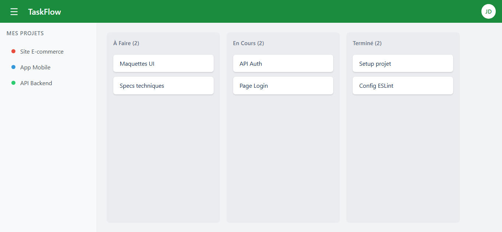

# TaskFlow

TaskFlow is a Kanban-style task management application built with React, TypeScript, and Vite. It features user authentication, dynamic project creation, and interactive task boards, utilizing a mock REST API (json-server) for data persistence and Redux Toolkit/Context API for state management.

## Screenshot



## Quick Start

```sh
# Install dependencies
cd taskflow
npm install

# Start JSON Server (in one terminal)
npx json-server --watch db.json --port 4000

# Start React app (in another terminal)
cd taskflow
npm run dev
```
